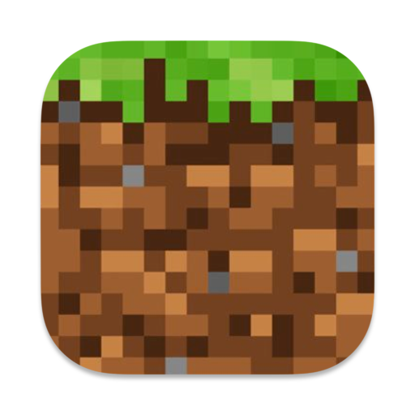
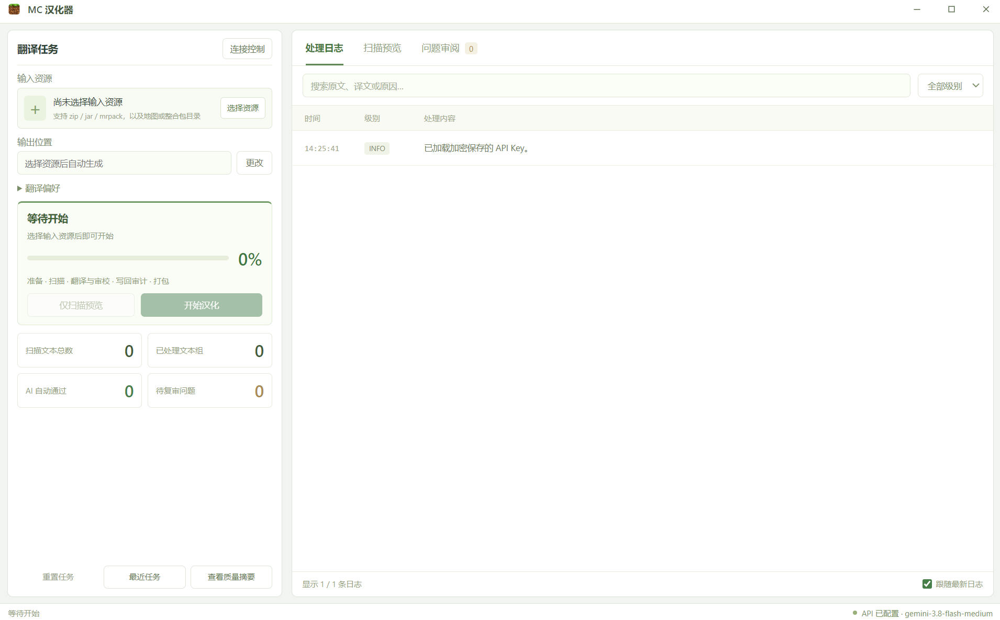

<p align="center">
  
</p>

<h1 align="center">MC 汉化器</h1>

<p align="center">
  把 Minecraft Java 版地图、整合包和模组(虽然目前只支持地图)<br>
  做成<strong>一份不改坏机制的中文副本</strong>
</p>


<p align="center">
  
  
  
</p>
<p align="center">
  <a href="#怎么用">怎么用</a>
  ·
  <a href="#使用前请知道">使用前请知道</a>
  ·
  <a href="#接下来会做什么">接下来会做什么</a>
</p>

<p align="center">
  
</p>


---

## 这是什么

上传文件，配好翻译api，然后坐着喝茶等翻译结束喵awa

它会：

1. **复制**你的文件，不改原件
2. **找出**告示牌、书、物品说明、语言文件等看得见的字
3. **尽量沿用**包里已有的中文和官方译名
4. **把剩下的**发给你配置的 AI 来译
5. **检查后再打包**，命令、坐标、物品 ID 这类机制内容保持原样，防止地图被破坏

适合想要玩国外地图但是苦于翻译问题的玩家喵~

## 怎么用

### 打包 exe

一次打包，到处双击。需要 Windows 和 Python 3.11+：

```powershell
python -m venv .venv
.\.venv\Scripts\Activate.ps1
python -m pip install -e ".[gui,packaging]"
powershell -ExecutionPolicy Bypass -File scripts\build_exe.ps1
```

打好的程序在 `dist\mc汉化器.exe`，拷到别的电脑也能直接用，不再需要 Python。

不想打包的话，装好依赖后跑 `python scripts/gui_entry.py` 也能直接启动。

### 汉化一张地图

1. 把 zip / jar / mrpack 或地图文件夹拖进去
2. 在「连接控制」里填上 AI 接口地址、密钥和模型
3. 点「开始汉化」，等进度走完
4. 进游戏翻翻告示牌、书和对话，看译得顺不顺

放心折腾：程序只改副本，你的原件动都不动。拿不准就先点「仅扫描预览」，看看会译哪些再开始。

<p align="center">
  
</p>

进度走完 ≠ 全部译完。哪些没译、为什么没译，报告里都写得明明白白。

## 使用前请知道

> [!WARNING]
> 要翻译的文字会发到**你自己填写的服务商**，可能产生费用。请用你信任、且余额足够的接口。

- 请用**副本**出包，保留原始地图。
- 译完请进游戏看关键流程，程序检查的是结构有没有写坏，不是玩法好不好读。
- 套了好几层的压缩包、特别老或特别新的地图，可能扫不全。
- 作者名、部分装饰字符、对机制有用的名字，常常会原样留下。
- 大图可能要较长时间，电脑也会比较吃资源。
- 中途停下再继续，会重新扫一遍并沿用已经合格的译文，不是从压缩包中间接着写。

## 接下来会做什么

| | |
| --- | --- |
| 正在做 | 把漏译、错译再收一收；服务不稳定时及时停下来，避免空打请求 |
| 接着做 | 让更大的地图更省内存；报告更好查；术语尽量对上地图版本 |
| 更远 | 处理套得更深的包；适配模组和整合包翻译 |

